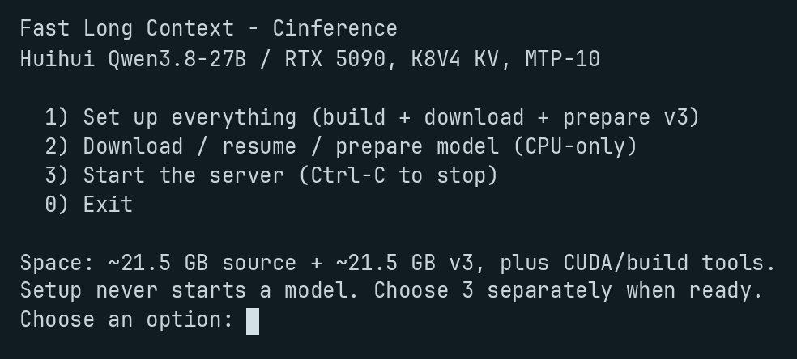

# Fast Long Context: Cinference

**Huihui Qwen3.8-27B Abliterated NVFP4, with a 256K context preset and MTP-10 on an RTX 5090 (32 GB).**

A one-menu installation recipe for [Barding-Defense's Huihui artifact](https://huggingface.co/Barding-Defense/Qwen3.8-27B-huihui-abliterated-NVFP4-NInfer), running on native C++/CUDA [Cinference](https://github.com/satellitedown/cinference), a modified [NInfer](https://github.com/Neroued/ninfer) engine. The preset uses **K8V4 KV cache**, **10 MTP draft tokens**, and the **optimized proposal head**. There is no separate drafter download or Python inference runtime.

## Run

For serving, you need **Linux x86_64, an RTX 5090 (32 GB), and working NVIDIA drivers compatible with CUDA 13.4**. Open a terminal and paste:

```bash
git clone https://github.com/satellitedown/fast-long-context-cinference.git
cd fast-long-context-cinference
bash setup.sh
```

### Launcher



1. Type **1** and press **Enter** to install the local tools, build Cinference, download the model, and prepare it automatically. If asked, approve installing missing system build dependencies.
2. When setup finishes, type **3** and press **Enter** to start the server. Wait for the listening message, then leave this terminal open while using it.

Choose **2** to download, resume, or retry model preparation. It installs the pinned Python downloader and runtime source needed for the upgrade, but skips the CUDA SDK and compilation. It can run without a GPU; choose **1** before serving if the runtime has not been built. Choose **0** to leave the menu. **Ctrl+C** interrupts setup or stops the foreground server.

Allow **about 21.5 GB for the publisher's original artifact plus 21.5 GB for the prepared artifact**, around **43 GB for both**, with additional space for CUDA, downloads, and build tools. The original is deliberately retained, not replaced.

Installation does **not** start inference, change NVIDIA drivers, or configure background services. The runtime, CUDA SDK, Python environment, and models stay inside this folder; uv and Hugging Face may also use their normal user-level caches and Python installations. Setup does not stop other servers or kill an occupied port. If port 8000 is in use, stop its current owner yourself or use a different `PORT` when launching.

## Connect to your favorite AI app

Start the server with option **3**, then ask your AI app or coding harness to configure it using this:

> Configure my AI app to use the local OpenAI-compatible server at `http://localhost:8000/v1` with model `qwen3.8-27b-huihui-abliterated-cinference`. It needs no API key. Set the context window to 262,144 tokens and maximum output to 32,768 tokens, within the remaining context space. Enable native function tools. Offer reasoning off, low, medium, and xhigh, not generic high. Do not request forced named tools or strict JSON-schema-constrained output; this API does not support them.

Keep it on localhost: the server has **no authentication**. The default bind address is `127.0.0.1:8000`. This recipe serves text and **one request at a time**. Queued requests can wait up to ten minutes; that is a queue deadline, not a generation timeout. The profile enables `--preserve-thinking`.

## Model preparation and resume

The publisher supplies a **version 2 `.ninfer` container**. This Cinference revision expects **version 3**, so setup runs `runtime/ninfer/tools/upgrade_ninfer_v2_to_v3.py` automatically with standard-library Python. This is a CPU-only format upgrade, not inference or requantization. It preserves weight bytes and installs the runtime's maintained Qwen3.8 chat template.

- Every run verifies the pinned SHA-256 of the original model, publisher `LICENSE`, `NOTICE`, artifact manifest, and conversion report. The original files remain unchanged in `models/Qwen3.8-27B-huihui-abliterated-NVFP4-NInfer/`.
- Preparation uses a private sibling staging directory and publishes `v3/` atomically only after completion. The final file is `v3/qwen3_8_27b_huihui_abliterated_nvfp4.ninfer`. Copies of the publisher's `LICENSE` and `NOTICE` accompany it.
- `v3/upgrade-receipt.json` records the source revision, input identity/checksum, runtime and upgrader identity, chat-template checksum, output UUID/checksum, and statement of changes. The upgrader generates a fresh UUID, so independently prepared outputs need not have identical hashes.
- Reruns verify and reuse a complete conversion. Interrupted downloads resume through the Hugging Face cache. Interrupted conversions restart after removing only recognized files in recipe-owned staging directories; a completed staged conversion can be published without repeating it.
- An existing invalid `v3/`, mismatched receipt, symlink, or unexpected staging content is not overwritten. Read the error, move the affected files aside yourself, and choose **2** again. Keep the receipt and publisher notices with the prepared artifact.

For a custom model location, use `.venv/bin/python scripts/download_models.py --models-dir /path/to/models` after setup, then set `MODEL_PATH` to the resulting **v3** file when running `bash scripts/serve.sh`.

## Hardware and configuration

**K8V4 means FP8 keys and NVFP4 values.** The default profile configures a 262,144-token total context window, 1,024-token prefill chunks, and a 32,768-token default output cap. Input, output, and reasoning must fit within the context window. Exact settings and immutable download pins are in [runtime-manifest.json](runtime-manifest.json); the foreground launcher is [scripts/serve.sh](scripts/serve.sh).

This recipe targets **NVIDIA Blackwell `sm_120a` on RTX 5090 32 GB**. Other GPUs are untested; Apple, AMD, and CPU inference are not supported. Desktop applications share VRAM, so available headroom varies. The local toolchain uses Python 3.12, CUDA 13.4.92, and two build jobs; a compatible C++20 compiler, FFmpeg development libraries, and libcurl development files are required to build.

Setup verification covered the native CUDA build, pinned-file checksums, the CPU-only v3 upgrade, byte-for-byte weight preservation, interruption/retry, reuse, and refusal to overwrite unrelated output. The engine's Python artifact reader accepted the prepared model, and the native server's `--help` ran successfully. Verification stopped before model loading; Huihui inference and throughput were not tested.

No benchmark for this Huihui checkpoint is published here. The engine repository's [scoped performance results](https://github.com/satellitedown/cinference#performance) describe their own checkpoint and configuration; they are not measurements of this recipe.

This is an abliterated model with altered refusal behavior. Review generated content and tool calls before acting on them, especially commands that can change files or systems.

## Credits

[Huihui AI](https://huggingface.co/huihui-ai/Huihui-Qwen3.8-27B-abliterated) provides the abliterated derivative of [Qwen / Alibaba Cloud's Qwen3.8-27B](https://huggingface.co/Qwen/Qwen3.8-27B). [Barding-Defense](https://huggingface.co/Barding-Defense/Qwen3.8-27B-huihui-abliterated-NVFP4-NInfer) publishes the NVFP4 NInfer artifact. [NInfer](https://github.com/Neroued/ninfer) provides the upstream engine, container format, and conversion tooling; [Cinference](https://github.com/satellitedown/cinference) supplies the modified runtime used here. Additional credit goes to Unsloth's quantization recipe, llm-compressor / compressed-tensors contributors, HuggingFaceH4's ultrachat-200k calibration data, and NVIDIA.

This repository contributes the Apache-2.0 installation recipe, not model weights. Downloaded software and artifacts retain their own licenses and notices. See [NOTICE](NOTICE) and the verified publisher files for attribution and provenance.
